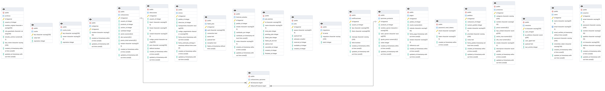
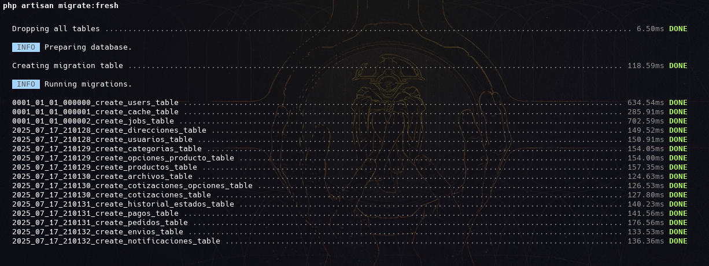
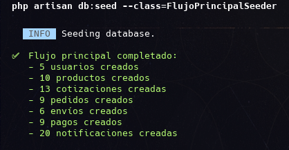
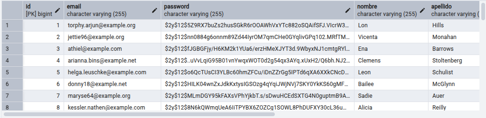
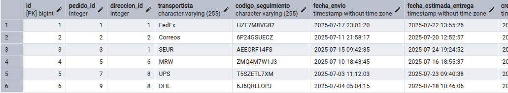
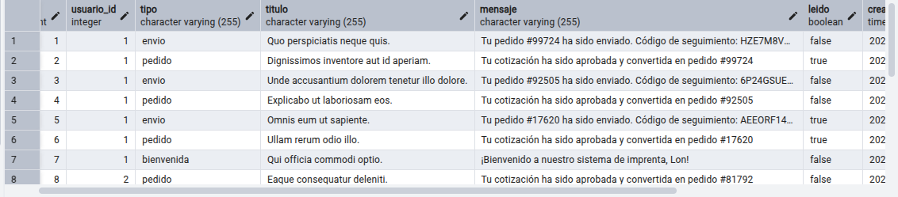
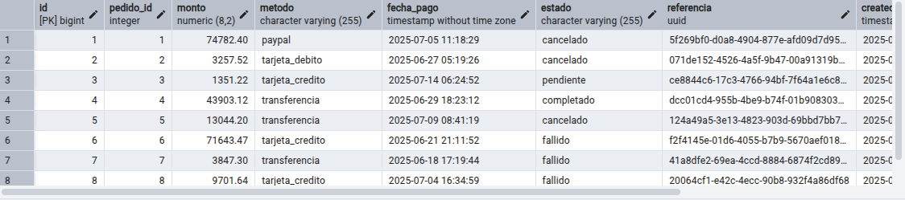

# 🖨️ Sistema de Gestión de Pedidos - Imprenta Digital

<p align="center">
  
  
  
  
</p>

## 📸 Capturas de Pantalla
### Diagrama - Entidad - Relacion


### Ejecucion de la migracion


### Ejecucion del seeder principal que ejecuta fabricas en cadena para crear todos los datos


### Contenido de la tabla Usuarios


### Contenido de la tabla Envios


### Contenido de la tabla Notificaciones


### Contenido de la tabla Pagos



## 📋 Descripción del Proyecto
Sistema de gestión de pedidos para imprenta digital: Plataforma web que permite a los clientes cargar diseños, cotizar, seleccionar impresiones y dar seguimiento a sus pedidos. Desarrollado con Laravel 12 y PostgreSQL para la materia Tecnología Web 2.

## 🚀 Funcionalidades Clave
Gestión de Usuarios: Registro, autenticación y perfiles con direcciones de envío.

Gestión de Productos: Catálogo con opciones personalizables y precios dinámicos.

Sistema de Cotizaciones: Cotizaciones automáticas, carga de archivos y historial.

Gestión de Pedidos: Conversión de cotizaciones a pedidos, seguimiento y prioridades.

Sistema de Pagos: Registro de pagos, estados y cálculos automáticos.

Sistema de Envíos: Gestión por transportista, códigos de seguimiento y fechas de entrega.

Sistema de Notificaciones: Alertas sobre el estado de pedidos y envíos.

## 🛠️ Instalación y Configuración

### 📋 Requisitos Previos

- **PHP 8.2+**
- **Composer**
- **PostgreSQL 12+**
- **Node.js & NPM** (opcional, para frontend)

### ⚡ Instalación Rápida

1. **Clonar el repositorio**
   ```bash
   git clone https://github.com/tu-usuario/proyecto-imprenta-laravel.git
   cd proyecto-imprenta-laravel
   ```

2. **Instalar dependencias**
   ```bash
   composer install
   ```

3. **Configurar variables de entorno**
   ```bash
   cp .env.example .env
   ```

4. **Configurar base de datos en `.env`**
   ```env
   DB_CONNECTION=pgsql
   DB_HOST=localhost
   DB_PORT=5432
   DB_DATABASE=proyecto_laravel
   DB_USERNAME=laravel_user
   DB_PASSWORD=laravel_password
   ```

5. **Crear base de datos PostgreSQL**
   ```sql
   CREATE DATABASE proyecto_laravel;
   CREATE USER laravel_user WITH PASSWORD 'laravel_password';
   GRANT ALL PRIVILEGES ON DATABASE proyecto_laravel TO laravel_user;
   ```

6. **Generar clave de aplicación**
   ```bash
   php artisan key:generate
   ```

7. **Ejecutar migraciones**
   ```bash
   php artisan migrate
   ```

8. **Poblar base de datos con datos de prueba**
   ```bash
   php artisan db:seed --class=FlujoPrincipalSeeder
   ```

9. **Iniciar servidor de desarrollo**
   ```bash
   php artisan serve
   ```

---
---
<p align="center">
  Detalles extras
</p>


## 🏗️ Arquitectura del Sistema

### 📊 Diagrama de Base de Datos
```
Usuarios → Cotizaciones → Pedidos → Envíos
    ↓           ↓           ↓        ↓
Direcciones   Archivos    Pagos   Notificaciones
                ↓           ↓
             Productos  Historial_Estados
                ↓
           Opciones_Producto
```

### 🗃️ Tablas Principales

| Tabla | Descripción | Registros Típicos |
|-------|-------------|------------------|
| `usuarios` | Clientes de la imprenta | 🙋‍♂️ Información personal |
| `productos` | Catálogo de servicios | 📄 Tarjetas, flyers, banners |
| `cotizaciones` | Solicitudes de precio | 💰 Precio según especificaciones |
| `pedidos` | Órdenes de trabajo | 📋 Estado, prioridad, notas |
| `envios` | Despachos y entregas | 🚚 Transportista, seguimiento |
| `pagos` | Transacciones financieras | 💳 Montos, estados |
| `notificaciones` | Comunicaciones | 🔔 Mensajes automáticos |

## 📁 Estructura del Proyecto

```
proyecto-imprenta-laravel/
├── app/
│   ├── Models/           # Modelos Eloquent
│   │   ├── Usuario.php
│   │   ├── Producto.php
│   │   ├── Cotizacion.php
│   │   ├── Pedido.php
│   │   └── ...
│   ├── Http/Controllers/ # Controladores
│   └── ...
├── database/
│   ├── migrations/       # Migraciones de BD
│   ├── seeders/         # Seeders de datos
│   │   └── FlujoPrincipalSeeder.php
│   └── factories/       # Factories para datos fake
├── resources/
│   ├── views/           # Vistas Blade
│   └── ...
└── ...
```


## 🎯 Seeder Principal - "Efecto Dominó"

El proyecto incluye un seeder especial llamado `FlujoPrincipalSeeder` que crea todo el ecosistema de datos relacionados de una sola vez:

```bash
php artisan db:seed --class=FlujoPrincipalSeeder
```

### 🔄 ¿Qué hace el FlujoPrincipalSeeder?

1. **Crea 5 usuarios** con sus respectivas direcciones
2. **Genera 10 productos** del catálogo
3. **Crea 13 cotizaciones** (2-3 por usuario)
4. **Convierte cotizaciones aprobadas en pedidos**
5. **Genera pagos** automáticamente
6. **Crea envíos** para pedidos completados
7. **Registra historial de estados** de cada pedido
8. **Envía notificaciones** en cada etapa del proceso

## 📄 Licencia

Este proyecto está bajo la licencia MIT. Ver el archivo [LICENSE](LICENSE) para más detalles.

## 👨‍💻 Autor

**Proyecto desarrollado para Tecnología Web 2**
- Universidad: Privada Domingo Savio
- Materia: Tecnología Web 2
- Año: 2025

---

<p align="center">
  <strong>🖨️ Sistema de Gestión de Pedidos - Imprenta Digital</strong><br>
  <em>Desarrollado con ❤️ usando Laravel y PostgreSQL</em>
</p>
